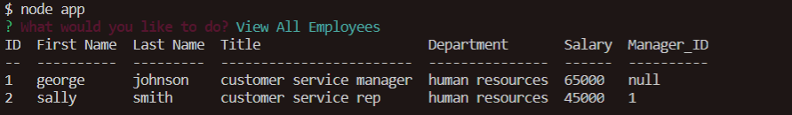
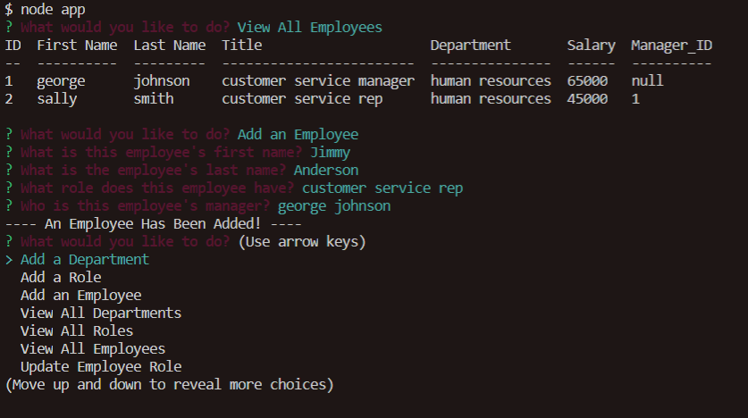
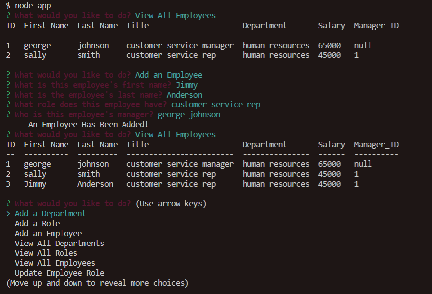

# Employee Tracker

## Overview:
This app will allow an employer to easily organize their employees.  Using MySQL a database is created that holds three seperate tables.  These tables contain employee, position, and department info.  The user is then able to manipulate the data in these tables by simply running through prompted questions.  This was primarily accomplished using Javascript, Node.JS, Inquirer, and MySQL.  

### Table of Contents:
1. [How it works](#How-it-works)
2. [Example](#Example)
3. [Installation](#Installation)
4. [Contributing](#Contributing)
5. [Questions](#Questions)
6. [License](#License)

### How it works!
After following the installation process for this app, run the command node app.js and a directory will appear.  This directory has options for the user to add a department, a role, or an employee.  It also has options to view the current departments, roles, and employees already entered into the database.  Lastly there is an option to update an exiting employees role.  Select one of these options from the directory and answer the prompted questions!

View Employees      Add an employee      View Employees again to see updated table.      

### Example
Here is a link to the Employee Tracker:  [https://github.com/vfavorito/employee-track](https://github.com/vfavorito/employee-track)

### Installation
Installation of this app first requires the installation of node.  Also you will need to have MySQL installed and a localhost server running.  Next you will have to change the MySql password in the code to your localhost password you set up.  After that install package files using npm i and you are good to go!

### Contributing
If you would like to contribute to the development of this app the guidelines for doing so can be found here: [Contribution Covenant](https://www.contributor-covenant.org/version/2/0/code_of_conduct/code_of_conduct.txt)

### Questions?
Visit my Github profile here: [vfavorito](https://github.com/vfavorito) 
If you have any questions you can reach out to me at vince.favorito@gmail.com

### License
This App is covered under the MIT License